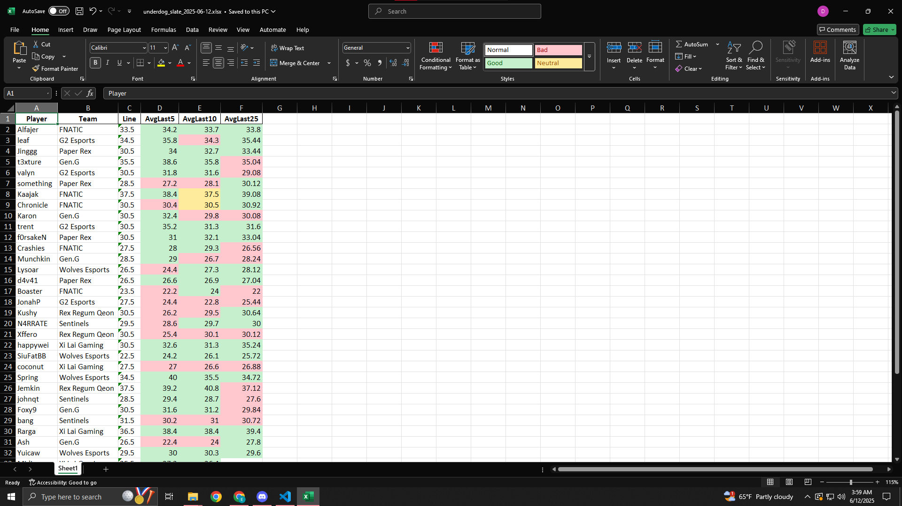

# Valorant Pick'em Analyzer

A user-friendly desktop tool for Valorant esports analysts, fantasy players, and bettors.  
Fetch player stats from [vlr.gg](https://vlr.gg), scrape Underdog Fantasy pick'em lines, and compare real player performance to betting lines—all in one place.  
Excel outputs are color-coded for instant visual analysis.

---

## 🚀 Quick Start

### **Recommended: Download the Standalone EXE**

- **No Python needed!**
- [Download the latest `.exe` release](https://github.com/elijah-farrell/valorant-pickem-analyzer/releases).
- Extract and double-click to start.
- All files and stats will save to the `data/` folder next to the app.

---

### **Alternative: Run from Source (Python)**

If you prefer to run from source (or are on Mac/Linux):

1. **Install requirements**

   ```sh
   pip install -r config/requirements.txt
   ```

2. **Run the tool**

   ```sh
   python main.py
   ```

---

## Features

- **Search any Valorant pro**—see their team, recent stats, and averages.
- **Auto-compare Underdog lines**—pulls the pick'em slate and fetches real stats from VLR.gg.
- **Color-coded Excel output**
    - **Green:** player average above the line (potential over value)
    - **Red:** below the line (potential under value)
    - **Yellow:** exactly equal
- **Fully local**—no data is uploaded or tracked.
- **No coding required**—simple command prompts guide you through each step.

---

## Output

- All summary and detail tables are saved as Excel (`.xlsx`) in the `data/` folder.
- Each player's stats are in their own Excel file for clarity.
- The main pick'em summary table is color-coded for instant reading.

---

## Tips for Viewing Results

- **Double-click the Excel files in the `data/` folder** after running the app.
- **VS Code users:** The [Excel Viewer extension](https://marketplace.visualstudio.com/items?itemName=GrapeCity.gc-excelviewer) lets you view `.xlsx` files inside VS Code.
- **Sort/filter:** Use Excel's filter buttons to sort by player, team, or color.

---

### Example Output



---

## Libraries Used

- **[pandas](https://pandas.pydata.org/):** Data analysis and Excel exporting
- **[openpyxl](https://openpyxl.readthedocs.io/):** Excel cell formatting and color coding
- **[requests](https://docs.python-requests.org/):** Fetching web pages and APIs
- **[beautifulsoup4](https://www.crummy.com/software/BeautifulSoup/):** HTML parsing for scraping VLR.gg
- **Python stdlib:** glob, os, datetime, etc.

---

## Project Structure

```
valorant-pickem-analyzer/
├── main.py
├── README.md
├── .gitignore
├── config/
│   ├── requirements.txt
│   └── valorant.ico
├── scraper/
│   ├── __init__.py
│   ├── vlr.py
│   └── underdog.py
├── data/
│   ├── agent_stats/
│   └── kills_by_match/
```

---

## Building Your Own EXE (Advanced/Windows)

If you want to build the `.exe` yourself:

```sh
pip install pyinstaller
pyinstaller --onefile --icon=config/valorant.ico main.py
```
The executable will appear in the `dist/` folder.

---

## FAQ

**Q: Does this tool place bets or interact with Underdog?**  
A: No. It only fetches public lines for informational and research purposes.

**Q: Does this work for other fantasy platforms?**  
A: Currently, only Underdog is supported, but the code is modular and easy to extend.

**Q: Can I use this on Mac/Linux/Windows?**  
A: Yes! The Python script runs everywhere. The `.exe` is for Windows only.

---

## Contributing

Pull requests and suggestions are welcome—especially for adding other betting APIs or new features!

---